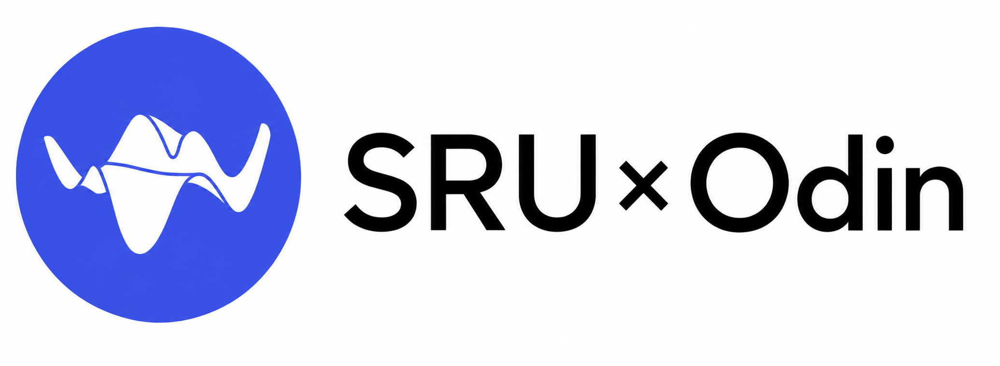

# SRU × Odin: Mapless Navigation with Spatially-Enhanced Recurrent Memory

<p align="center">
  
</p>

<p align="center">
  
  
  
  
</p>

<p align="center">
  <b>Deploy cutting-edge paper within half a day using Odin1.</b>
</p>

<p align="center">
  
</p>

<p align="center">
  🎬 <a href="https://b23.tv/8nKRBNw">Watch the full demo video</a>
</p>

---

## 1. Introduction

**SRU × Odin** brings the ETH RSL **SRU** (*Spatially-Enhanced Recurrent Memory for
Long-Range Mapless Navigation via End-to-End Reinforcement Learning*) policy to a real
quadruped using a single **Odin1** spatial-memory sensor. The original work relies on a
**ZED-X** stereo camera for depth mapping and a **DLIO** LIO stack for high-precision
odometry tracking; this project collapses both of those subsystems into one compact sensor.

> **Highlight — one sensor replaces two subsystems.** The **Odin1 spatial memory
> module completely replaces BOTH the depth-mapping functionality of the original ZED
> camera AND the high-precision odometry tracking from the DLIO LIO stack** used in the
> upstream paper. Odin1 publishes a depth stream (`sensor_msgs/Image`, meters,
> ~10 Hz) together with a high-frequency odometry topic, so a single device covers both
> exteroception and state estimation.

> **Highlight — Code Generation.** You do not have to hand-write the deployment stack. A
> structured LLM prompt (`Prompt/PORTING_GUIDE.md`) lets an AI agent **automatically
> generate ready-to-use navigation deployment code for physical robots** — from ONNX I/O
> specification through the ROS node down to the launch scripts.

**Paper:** *Spatially-Enhanced Recurrent Memory for Long-Range Mapless Navigation via
End-to-End Reinforcement Learning* — DOI: <https://doi.org/10.1177/02783649251401926> ·
Project page: <https://michaelfyang.github.io/sru-project-website/>

### Related Work

- **[ManifoldTech Real2Sim Tutorial](https://github.com/ManifoldTechLtd/MT-Real2Sim-Tutorial)** — Transform the real world into a simulated environment using Q9000.
- **[Odin-Nav-Stack](https://github.com/ManifoldTechLtd/Odin-Nav-Stack)** — A full-stack navigation framework based on Odin, integrating end-to-end navigation (NeuPAN), classical navigation, modular navigation, VLM, YOLO object detection, and VLN (Vision-and-Language Navigation) into a unified system.

---

## 2. Key Features

- **End-to-end mapless navigation** — depth image + goal vector → velocity command
  (`/cmd_vel`), with no occupancy grid, no SLAM map, and no global planner.
- **Spatially-enhanced recurrent memory** — a VAE depth encoder feeds an LSTM-SRU actor
  (`rnn_hidden_size=512`, `num_layers=1`) that remembers where obstacles were.
- **One sensor, two subsystems replaced** — the Odin1 spatial memory module supplies BOTH
  the depth mapping that upstream took from the ZED-X camera AND the high-precision
  odometry that upstream took from the DLIO LIO stack.
- **Sensor-agnostic depth pipeline** — any depth image works; Odin1 is the
  reference sensor, ZED-X the upstream original.
- **Robot-agnostic output** — publishes a body-frame `geometry_msgs/Twist`; any robot with
  a `/cmd_vel` bridge can be driven.
- **ONNX Runtime inference** — no PyTorch at deployment time; single-file models, easy
  CPU/GPU EP switching, ready-made aarch64 wheels for Jetson.
- **Reproducible Docker training** — Isaac Sim 4.5.0 + IsaacLab v2.1.1 image, one-click
  training scripts, VRAM-aware environment scaling.
- **Prompt-driven deployment** — a physically tested ROS1 Noetic package plus a
  prompt-driven workflow to regenerate it from scratch.

---

## 3. System Architecture

```
   ┌──────────────────────────── TRAINING (Isaac Sim 4.5 / Docker) ────────────────────────────┐
   │                                                                                            │
   │   IsaacLab v2.1.1  +  sru-navigation-sim task  +  rsl_rl (ActorCriticSRU: VAE + LSTM-SRU)  │
   │   parallel envs ──► PPO/MDPO ──► checkpoints (outputs/logs/.../model_*.pt)                 │
   │                                                                                            │
   └───────────────────────────────────────────┬────────────────────────────────────────────┘
                                                │  scripts/export_onnx.py
                                                ▼
   ┌──────────────────────────────── POLICY EXPORT ────────────────────────────────┐
   │   model_best.pt  ──►  policy.onnx   (obs[1,2576] + h/c[1,1,512] → act[1,3])     │
   │   (deployment split: vae_encoder.onnx  +  nav_policy.onnx)                      │
   └───────────────────────────────────────────┬──────────────────────────────────┘
                                                │  copy into Deployment/models/
                                                ▼
   ┌──────────────────────── DEPLOYMENT (Go2 + Odin1 + ROS1 Noetic) ─────────────────────┐
   │                                                                                        │
   │   Odin1 driver ──► /odin1/depth_img_competetion (depth)                                │
   │                └─► /odin1/odometry_highfreq (odom)                                     │
   │                              │                                                         │
   │                              ▼                                                         │
   │   sru_nav_node:  depth ─► VAE encoder ─► latent ─┐                                     │
   │                  odom + goal + prev_action ──────┼─► LSTM-SRU actor ─► /cmd_vel        │
   │                  LSTM (h,c) held across frames ──┘        (Twist, body frame)          │
   │                              │                                                         │
   │                              ▼                                                         │
   │   cmd_vel bridge (unitree_legged_sdk) ──► sport-mode joint commands                    │
   └────────────────────────────────────────────────────────────────────────────────────┘
```

---

## 4. Repository Structure

```
SRU_GO2_ODIN1/
├── Prompt/
│   └── PORTING_GUIDE.md        # Source-of-truth prompt for LLM-based code generation
├── Deployment/                 # Tested, working ROS1 deployment package (reference)
│   ├── src/sru_nav_go2/        #   ONNX inference node + helpers (Odin1)
│   ├── config/sru_nav.yaml     #   The ONLY file users normally edit
│   ├── launch/sru_nav_go2.launch
│   ├── scripts/                #   setup_conda_env.sh, launch_sru_nav.sh, verify_port.sh
│   ├── models/                 #   vae_encoder.onnx + nav_policy.onnx (user-supplied)
│   └── docs/                   #   DEPLOY_GO2_NX.md, PORTING_GUIDE(_EN).md
├── Train/                      # Isaac Sim 4.5 Docker training environment
│   ├── Dockerfile              #   Base: nvcr.io/nvidia/isaac-sim:4.5.0
│   ├── docker-compose.yml      #   shm_size 16gb, NVIDIA runtime, cache volumes
│   ├── scripts/                #   train_go2_scratch.sh, export_onnx.py
│   ├── mount/                  #   IsaacLab / rsl_rl / sru-navigation-sim (live-mounted)
│   └── outputs/logs/           #   Checkpoints + TensorBoard logs
└── referee_readme/             # Style/structure reference READMEs
```

The three top-level directories map to the three phases of the project:

| Directory      | Role                                                                 |
| -------------- | ------------------------------------------------------------------- |
| `Prompt/`      | The porting prompt — regenerate the deployment package from scratch |
| `Deployment/`  | Physically validated deployment code, a practical debugging reference |
| `Train/`       | Reproducible Docker environment to (re)train the policy             |

---

## 5. Prompt-Based Code Generation & Deployment

`Prompt/PORTING_GUIDE.md` is a **three-in-one document**: a porting decision log, an
AI-agent replication prompt, and an automated acceptance script. Its purpose is to let an
LLM agent (Cascade, Claude Code, Cursor, etc.) **regenerate the entire `sru_nav_go2_ros1`
deployment package** starting only from the SRU paper and the five upstream repositories.

### 5.1 The Prompt

Modern LLMs cannot reliably one-shot ~1500 lines of ROS porting code, so
`Prompt/PORTING_GUIDE.md` cuts the task into a **6-step phased workflow**: reconnaissance,
IO specification, catkin skeleton, node logic, deploy scripts, and docs & verify. Each step
ends with grep-able validation points, so any diverging step is rolled back and retried
before moving on. The prompt is plain Markdown and works with any LLM coding agent.

### 5.2 `Deployment/` as a practical reference

The `Deployment/` package is **not generated on the fly** — it is the physically tested,
real-hardware-validated code. Think of it as a highly practical reference rather than a
strict rulebook: if you hit problems while replicating the code through the prompt workflow,
diff your generated package against `Deployment/` to debug and troubleshoot the divergence.

```bash
diff -r --exclude=__pycache__ --exclude=.git \
     ./generated_sru_nav_go2_ros1/ \
     ./Deployment/
```

> **Tip:** Structure should be broadly similar; comments and literal ordering may differ.
> When something misbehaves, focus your comparison on the critical parameters
> (`policy_scale`, control frequency, topic names, ONNX tensor shapes) — those are the ones
> that must match for correct behavior.

> The quality of code generated via the prompt workflow may vary depending on
> the capability of the LLM used. In some cases, the generated code may require further
> iteration and refinement with the LLM to achieve full functionality. Always validate
> against the `Deployment/` reference and run the acceptance checks before deploying to
> real hardware.

---

## 6. Training Guide

This is the core focus of the repository. Training is fully containerized around
**Isaac Sim 4.5.0 + IsaacLab v2.1.1** and the `sru-navigation-sim` task extension.

### 6.1 Adaptation Notes

**Sensor adaptation — ZED-X + DLIO → Odin1.**
The policy consumes a normalized single-channel depth image encoded by a VAE into a
`64×5×8` latent (2560 features). Upstream produced depth from a ZED-X stereo stream and
odometry from a DLIO LIO stack; here a single Odin1 sensor supplies both. The node ingests
Odin1's depth image, applies `nan_to_num`, clips to `[0.25, 10.0] m`, and
resizes to the training resolution `(40, 64)` before encoding — the network sees the same
tensor regardless of the physical sensor.

**Robot kinematics — B2W → Unitree Go2.**
The upstream B2W is a wheeled-legged platform; the target here is the Unitree Go2. Because the
policy only emits a body-frame velocity command, the kinematic difference is absorbed by
the actuator bridge and by a conservative action scale. The deployment `policy_scale`
defaults to `[0.6, 0.3, 0.6]` (vs. the training `[1.5, 1.0, 1.0]`), leaving safety margin;
training randomized the action scale by `Uniform(0.6, 1.2)`, so the network is robust to
runtime rescaling.

### 6.2 Quick Start — Docker Training

#### Step 1 — Docker setup, NGC login, and build

```bash
# NVIDIA NGC login is required to pull the Isaac Sim base image.
docker login nvcr.io
#   Username: $oauthtoken
#   Password: <YOUR_NGC_API_KEY>

cd Train/
cp .env.example .env          # optional: add WANDB_API_KEY
docker compose build          # first build > 20 min (network dependent)
```

The build pulls `nvcr.io/nvidia/isaac-sim:4.5.0`, installs IsaacLab `v2.1.1`, replaces the
bundled `rsl_rl` with the SRU-enhanced fork (`ActorCriticSRU` + MDPO/PPO), and installs the
`sru-navigation-sim` task extension.

> **Warning — Shared memory is mandatory:** Isaac Sim's OmniGraph pipeline crashes (often as
> a silent segfault) if the container's shared memory is too small. Always run with at least
> **`--shm-size=4gb`** for `docker run`, or **`shm_size: '4gb'`** under the service in
> `docker-compose.yml`. This repository's `docker-compose.yml` and `train_go2_scratch.sh`
> already set `16gb` — do **not** lower this below `4gb`.

#### Step 2 — Launch the container and verify

```bash
docker compose up -d
docker compose exec sru-nav bash          # working dir: /workspace/IsaacLab

# Inside the container: confirm the task extension + registered tasks
./isaaclab.sh -p -m pip show isaaclab_nav_task
./isaaclab.sh -p source/isaaclab_nav_task/scripts/train.py --help
```

You should see task IDs such as `Isaac-Nav-PPO-Go2-Dev-v0` and `Isaac-Nav-PPO-Go2-v0`.

#### Step 3 — One-click training with environment variables

From the host, `scripts/train_go2_scratch.sh` launches a cold-start training run inside a
disposable container (headless, 24 envs, 1000 iterations, `Isaac-Nav-PPO-Go2-Dev-v0` by
default). All knobs are overridable via environment variables:

```bash
# Default: 24 envs, 1000 iter, headless (safe on a 12 GB card)
./scripts/train_go2_scratch.sh

# Scale the parallel environment count to your GPU
NUM_ENVS=64 MAX_ITER=2000 ./scripts/train_go2_scratch.sh

# GUI debugging with a handful of envs
GUI=1 NUM_ENVS=4 MAX_ITER=200 ./scripts/train_go2_scratch.sh

# Pin a specific GPU and run the full PPO task
GPU=0 TASK=Isaac-Nav-PPO-Go2-v0 RUN_NAME=scratch_full ./scripts/train_go2_scratch.sh
```

> **VRAM Hardware Scaling Table** — pick `NUM_ENVS` to match your GPU:

| GPU                 | VRAM  | Recommended `NUM_ENVS` |
| ------------------- | ----- | ---------------------- |
| RTX 4090            | 24 GB | 64–128                 |
| RTX 4070 / 5070     | 12 GB | 24 (default)           |
| 8 GB Laptop GPU     | 8 GB  | 8–12                   |

> **Note:** On a 12 GB card, `GUI=1` combined with a large `NUM_ENVS` will OOM — keep GUI
> runs to ≤ 4 envs and use `--headless` (the default) for real training.

Outputs land in `outputs/logs/rsl_rl/<experiment>/<timestamp>_<RUN_NAME>/` on the host
(bind-mounted into the container).

#### Step 4 — Monitor and export

**Monitor** live metrics with TensorBoard:

```bash
# TensorBoard (inside container)
docker compose exec sru-nav \
    ./isaaclab.sh -p -m tensorboard.main --logdir logs --bind_all
#   then open http://<host>:6006
```

**Export** the trained checkpoint to ONNX. The exporter reconstructs `ActorCriticSRU` from
the checkpoint weight shapes (no Isaac Sim needed) and writes `policy.onnx`:

```bash
python scripts/export_onnx.py \
    --checkpoint outputs/logs/scratch_reward_fix_v1/model_best.pt \
    --output-dir mount/
```

Useful flags (from `scripts/export_onnx.py`):

| Flag           | Default        | Description                              |
| -------------- | -------------- | ---------------------------------------- |
| `--checkpoint` | *(required)*   | Path to the `.pt` checkpoint             |
| `--output-dir` | `<ckpt>/export`| Output directory                         |
| `--filename`   | `policy.onnx`  | Output filename                          |
| `--jit`        | off            | Also export a TorchScript `policy.pt`    |
| `--verbose`    | off            | Print inferred config + architecture     |

Copy the exported model(s) into `Deployment/models/` for on-robot inference.

---

## 7. ONNX I/O Contract

The training-side export (`export_onnx.py`) produces a **single combined actor** ONNX that
already ingests the fused observation vector:

| Model         | Tensor    | Shape             | Notes                                  |
| ------------- | --------- | ----------------- | -------------------------------------- |
| `policy.onnx` | `obs`     | `(1, 2576)`       | 16 proprio + 2560 image latent (64×5×8)|
| (input)       | `h_in`    | `(1, 1, 512)`     | LSTM hidden; zeros at episode start    |
| (input)       | `c_in`    | `(1, 1, 512)`     | LSTM cell; zeros at episode start      |
| `policy.onnx` | `actions` | `(1, 3)`          | `tanh` output in `(-1, 1)`             |
| (output)      | `h_out`   | `(1, 1, 512)`     | updated hidden state                   |
| (output)      | `c_out`   | `(1, 1, 512)`     | updated cell state                     |

The **deployment** package splits inference into two ONNX files so the depth encoder and the
recurrent actor can be validated independently:

| Model              | Inputs                                   | Outputs                            |
| ------------------ | ---------------------------------------- | ---------------------------------- |
| `vae_encoder.onnx` | `input` `(B, 1, 40, 64)`                 | `mu` `(B, 64, 5, 8)`               |
| `nav_policy.onnx`  | `obs` `(B, 2576)`, `h` `(1, B, 512)`, `c` `(1, B, 512)` | `actions` `(B, 3)`, `h_new`, `c_new` |

> **Note:** The node discovers tensor names via `session.get_inputs()[i].name` **and**
> asserts them against this contract at startup — a shape mismatch raises immediately rather
> than silently producing garbage commands. Final velocity =
> `tanh_output × policy_scale`, with `policy_scale = [0.6, 0.3, 0.6]` → `[vx, vy, ωz]`.

---

## 8. Real-Hardware Deployment

### 8.1 Hardware & Software Requirements

| Component        | Requirement                                                          |
| ---------------- | -------------------------------------------------------------------- |
| Robot            | Unitree Go2 (or any `/cmd_vel` consumer quadruped)                  |
| Depth sensor     | Odin1 (depth ~10 Hz + high-freq odometry); see launch file for physical mounting offsets |
| Compute          | Jetson Orin NX (aarch64) or any Linux x86_64                         |
| OS               | Ubuntu 20.04 (native ROS Noetic) or `osrf/ros:noetic-desktop` docker |
| Middleware       | ROS1 Noetic                                                          |
| Python env       | conda `sru_go2`, Python **3.8** (bound to Noetic ABI — do not change)|
| Inference        | `onnxruntime` (CPU) or `onnxruntime-gpu` (JetPack-matched wheel)     |
| Operator input   | Unitree remote control                                               |

### 8.2 ROS1 Interface

| Topic                          | Type                       | Direction | Description                          |
| ------------------------------ | -------------------------- | --------- | ------------------------------------ |
| `/odin1/depth_img_competetion` | `sensor_msgs/Image`        | in        | dense float32 depth, meters, ~10 Hz  |
| `/odin1/odometry_highfreq`     | `nav_msgs/Odometry`        | in        | odom frame, ~400 Hz (IMU rate)       |
| `/joy`                         | `sensor_msgs/Joy`          | in        | Unitree remote control input         |
| `/goal_pose`                   | `geometry_msgs/PoseStamped`| in / out  | goal; `frame_id` must equal odom frame|
| `/cmd_vel`                     | `geometry_msgs/Twist`      | out       | body-frame velocity command          |

> **Note:** `/goal_pose.header.frame_id` **must** match the odom `frame_id` (default
> `odom`); otherwise the node rejects the goal to prevent body-frame coordinates being
> published as odom-frame goals.

### 8.3 Build & Environment Setup

Because conda and system ROS coexist, the launch wrapper handles several ABI hazards
automatically (notably the conda/system `libffi` mismatch that otherwise triggers
`libp11-kit.so.0: undefined symbol: ffi_type_pointer`). You do not need to configure
anything by hand — `launch_sru_nav.sh` takes care of it.

One-time setup then build inside the conda env at the workspace root:

```bash
# 1) Create the conda env (installs onnxruntime, opencv, netifaces, defusedxml, ...)
bash scripts/setup_conda_env.sh
bash scripts/setup_conda_env.sh --check       # ROS dist-packages may [FAIL] outside a container

# 2) Build in the ACTIVATED conda env, at the workspace root
conda activate sru_go2
cd $CATKIN_WS                                  # folder containing src/
catkin_make -DPYTHON_EXECUTABLE=$(which python)

# 3) Self-check
cd $CATKIN_WS/src/sru_nav_go2_ros1
bash scripts/verify_port.sh                    # all PASS when ONNX present
```

### 8.4 Three-Terminal Launch

The first process to start brings up `roscore`.

**Terminal 1 — Odin1 driver**

```bash
conda activate neupan
roslaunch odin_ros_driver odin1_ros1.launch
#   Ensure config/control_command.yaml has  senddepth: 1  and  sendodom: 1
```

**Terminal 2 — `/cmd_vel` actuator bridge**

```bash
conda activate sru_go2
cd $CATKIN_WS && source devel/setup.bash
rosrun unitree_control unitree_vel_controller __name:=vel_to_sdk
```

**Terminal 3 — SRU navigation node**

```bash
cd $CATKIN_WS/src/sru_nav_go2_ros1
bash scripts/launch_sru_nav.sh require_joystick:=false
```

Setting `require_joystick:=false` stops the Unitree remote control from constantly
broadcasting zero-velocity commands.

Send a goal (in the odom frame) and watch `/cmd_vel`:

```bash
rostopic pub -1 /goal_pose geometry_msgs/PoseStamped \
  '{header: {frame_id: "odom"}, pose: {position: {x: 1.0, y: 0.0, z: 0.0}, orientation: {w: 1.0}}}'
rostopic echo /cmd_vel     # expect a non-zero Twist stream
```

### 8.5 Configuration Notes

Edit `Deployment/config/sru_nav.yaml` — the only file you normally touch:

| Parameter           | Default              | Meaning                                             |
| ------------------- | -------------------- | --------------------------------------------------- |
| `depth_topic`       | `/odin1/depth_img_competetion` | depth image (meters)                      |
| `odom_topic`        | `/odin1/odometry_highfreq`     | world-frame odometry                      |
| `cmd_vel_topic`     | `/cmd_vel`           | output body-frame velocity                          |
| `control_frequency` | `5.0`                | Hz — keep aligned with training                     |
| `policy_scale`      | `[0.6, 0.3, 0.6]`    | `[vx_max, vy_max, ωz_max]`; raise gradually         |
| `min_depth`/`max_depth` | `0.25` / `10.0`  | depth clip range (meters)                           |
| `use_sim`           | `false`              | `true` = odom twist already in base frame           |
| `require_joystick`  | `true`               | `false` stops the remote from broadcasting zero-velocity locks (TESTING ONLY) |

### 8.6 Camera Mounting

Camera mounting is set in the launch file, which publishes a static TF
`base_link → odin1_base_link` (adjust to the real measured mount). Offsets are xyz in
meters (forward, left, up) and rpy in radians; defaults are `odin1_x=0.258`, `odin1_y=0.0`,
`odin1_z=0.154`, `odin1_roll=0.0`, `odin1_pitch=0.0` (0° downward), `odin1_yaw=0.0`:

```bash
roslaunch sru_nav_go2 sru_nav_go2.launch odin1_x:=0.28 odin1_z:=0.154 odin1_pitch:=0.0
```

---

## 9. Troubleshooting / Common Pitfalls

| # | Problem | Solution |
| - | ------- | -------- |
| 1 | **`/cmd_vel` is all zeros.** Node logs "ready" but the robot never moves. | The Unitree remote control is holding the robot stationary with zero-velocity commands. On jack stands / sim, launch with `require_joystick:=false`. |
| 2 | **`ModuleNotFoundError: netifaces` / crash on first subscriber.** Node reaches "ready" then dies the moment a topic connects. | `netifaces` / `defusedxml` are missing in the conda env. `pip install netifaces defusedxml` (already built into `setup_conda_env.sh`). |
| 3 | **`libp11-kit.so.0: undefined symbol: ffi_type_pointer`.** | Conda's libffi clashes with system `cv_bridge`. Launch via `launch_sru_nav.sh` — the launch script handles this automatically. |
| 4 | **Node shebang points to `/usr/bin/python3`; ONNX import fails.** | `catkin_make` was run outside the conda env. `conda activate sru_go2 && cd $CATKIN_WS && catkin_make clean && catkin_make -DPYTHON_EXECUTABLE=$(which python)`. |
| 5 | **`zsh` terminal: `setup.zsh: line 7: cd: -q: invalid option`, script dies silently.** | `ZSH_VERSION` leaks into the bash subprocess. `launch_sru_nav.sh` fixes this by exporting `CATKIN_SHELL=bash` and unsetting `ZSH_VERSION`/`ZSH_NAME` before sourcing. |

> **Note (bonus):** Isaac Sim training crashes with an OmniGraph shared-memory error →
> increase `shm_size` (≥ 4 GB, repo default 16 GB). Jetson pip TLS handshake failures →
> the RTC drained; run `sudo ntpdate -u ntp.aliyun.com && sudo hwclock --systohc`.

---

## 10. Citation

If you use this work, please cite the SRU paper:

```bibtex
@article{yang2025sru,
  author = {Yang, Fan and Frivik, Per and Hoeller, David and Wang, Chen and Cadena, Cesar and Hutter, Marco},
  title = {Spatially-enhanced recurrent memory for long-range mapless navigation via end-to-end reinforcement learning},
  journal = {The International Journal of Robotics Research},
  year = {2025},
  doi = {10.1177/02783649251401926},
  url = {https://doi.org/10.1177/02783649251401926}
}
```

Paper: <https://doi.org/10.1177/02783649251401926> ·
Project page: <https://michaelfyang.github.io/sru-project-website/>

---

## 11. Acknowledgments

This project builds upon: <https://github.com/sallu-786/Go2_Isaac_ros2>

---

## 12. License

- **Algorithm & training code** — copyright of the original SRU author team (ETH RSL);
  follows their upstream LICENSE. Files containing upstream-derived code retain their
  original headers.
- **This deployment port** (`Deployment/`) — released under an **MIT-style** license.
- **Upstream sources:** `sru-navigation-learning`, `sru-navigation-sim`,
  `sru-robot-deployment`, `sru-pytorch-spatial-learning`, `sru-depth-pretraining`
  (see <https://michaelfyang.github.io/sru-project-website/>).
- **Simulation stack:** NVIDIA Isaac Sim 4.5.0 + IsaacLab v2.1.1.
- **Odin1 driver:** <https://github.com/manifoldsdk/odin_ros_driver>.

Issues and PRs — especially one-click support for additional robots or cameras — are welcome.
